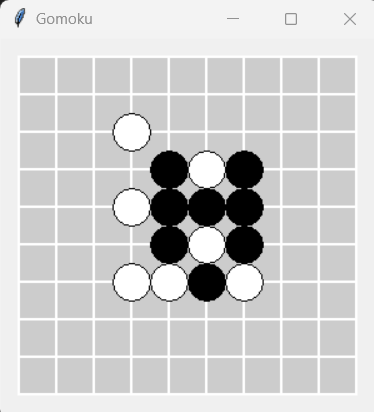

# Gomoku

Gomoku, also called as Five in a Row, is an interesting strategy board game. This repository implements the Gomoku game and also provides a good template for development.

## For Players
For those who only want to play the Gomoku game, you can run the `src/play.py` file to start a new game. We support any size of board, which can be specified by the parameters `width` and `height`. We also support many differnt AI players, which are implemented by different search algorithms.

Up to now, the AI players supported in this repository include:

| AI Player Type | Search Algorithm |
| ---- | ---- |
| Human | - |
| GUIHuman | - |
| MinimaxSearchPlayer | Simple Minimax Search |
| AlphaBetaSearchPlayer | Minimax Search with Alpha-Beta Pruning |
| CuttingOffSearchPlayer | Minimax Search with Evaluate Function |
| MCTSPlayer | Random Monte-Carlo Treee Search |
| AlphaZeroPlayer | Monte-Carlo Treee Search with Evaluate Function |

An example of starting a man-machine game is as follows: `python3 src/play.py --width 10 --height 10 --n_in_row 5 --player_1 GUIHuman --player_2 CuttingOffSearchPlayer --max_depth 1 --evaluation_func detailed_evaluation_func --gui`

For more info, you can check the arguments defined in the `play.py`.

## For Developers
For Gomoku strategy developers, you can easily develop AI players, game interfaces and game strategies under the framework of this repository.

For instance, to design a specific AI player, you can inherit the `Player` class in the `src/player` folder and then implement your AI.

## More Info
This repository is adapted from the first assignment in the "Introduction to Artificial Intelligence" class at Tsinghua University.

## License
MIT License

